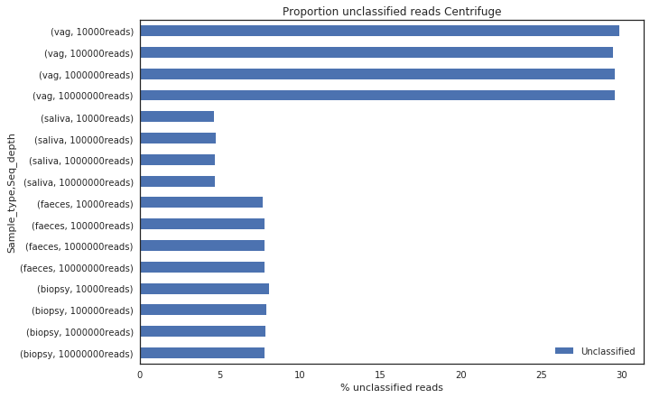
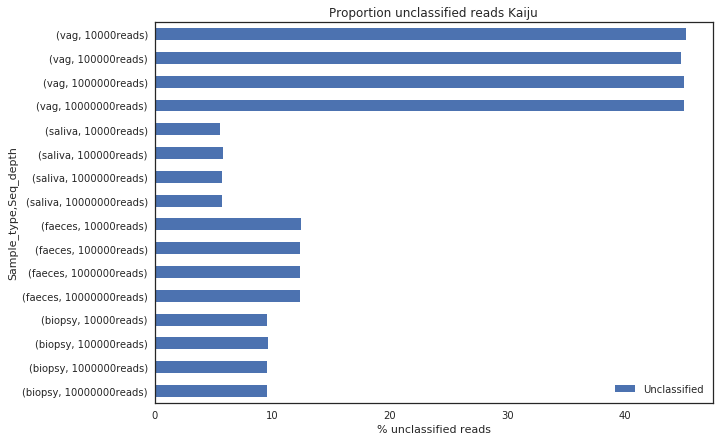
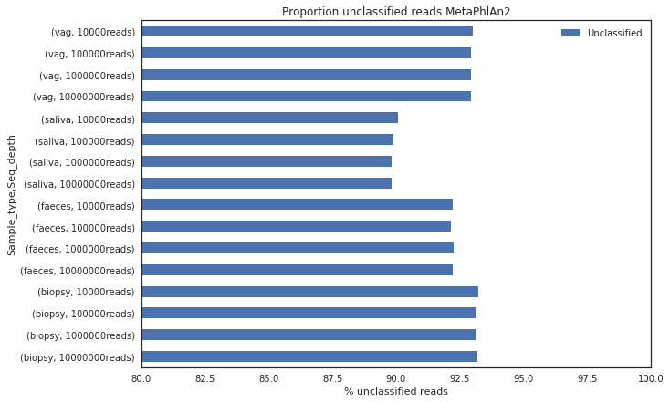
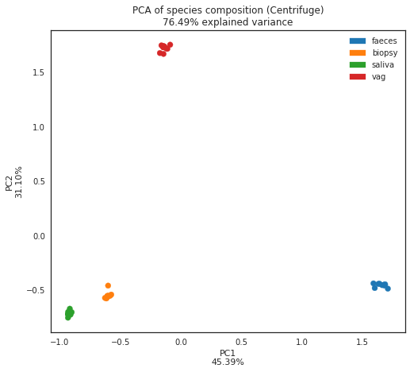
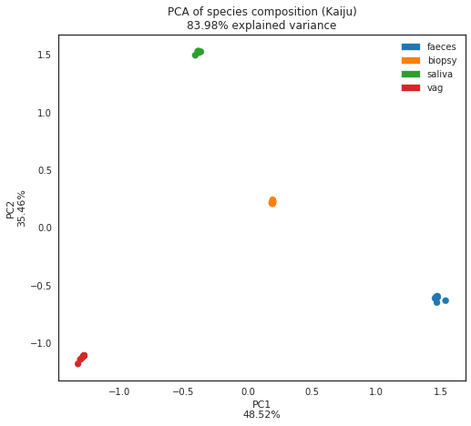
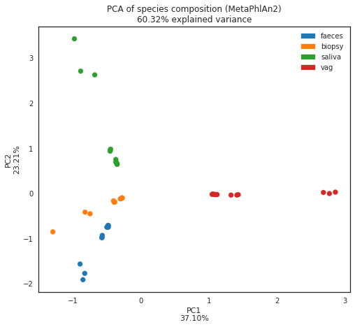
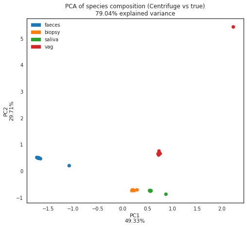
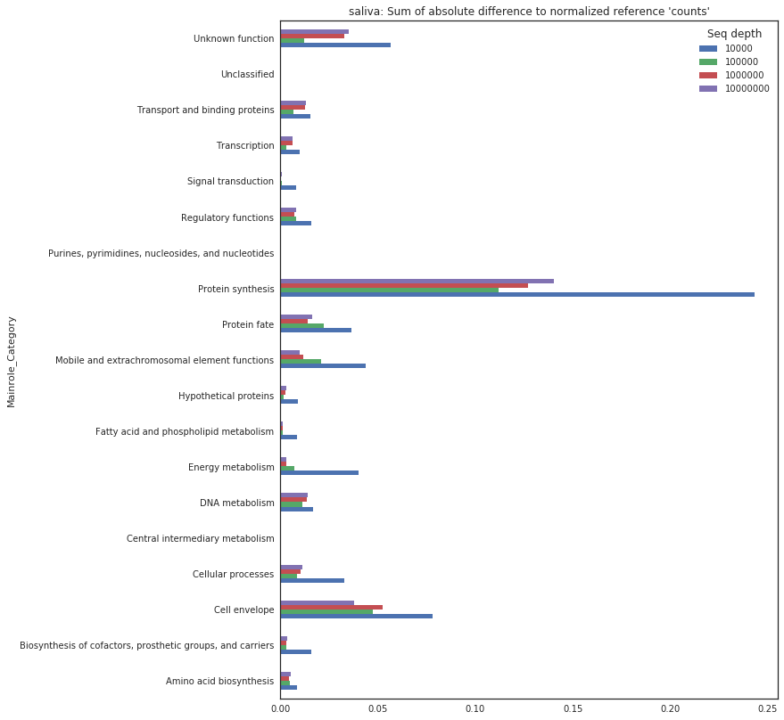
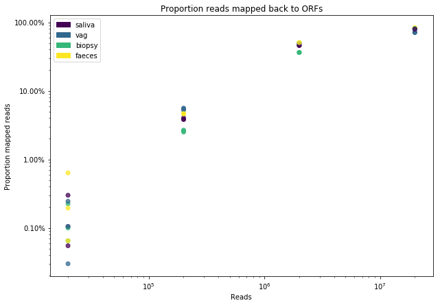
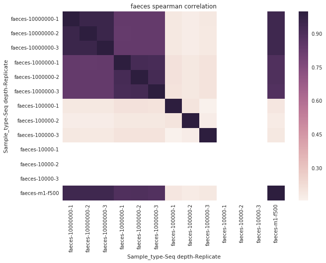

##################################################
Estimation of minimum metagenomic sequencing depth
##################################################
This report represents a draft summary of the outcomes of estimating the
required sequencing depth for different types of shotgun metagenome samples.

:Authors: Fredrik Boulund, <fredrik.boulund@ki.se>, Luisa Hugerth, <luisa.hugerth@ki.se>
:Date: 2017-12-19

Background
==========
The microbiome composition and microbial load of different sample types can
vary significantly.  For example, intestinal biopsies have been estimated to
contain about 1-3% microbial DNA, making it difficult (and potentially
expensive) to achieve decent resolution of microbial DNA using brute force
shotgun methods.

This work was a small pilot to provide descent guesstimates to use as starting
points for assessing the costs associated with shotgun sequencing of different
types of microbiome samples.

Methods
=======
The steps to assess the required sequencing depth are described in detail below. 
All code related to this endeavour is located in our `Github repository`_.

.. _Github repository: https://github.com/ctmrbio/estimate_seq_depth

Simulated sample type compositions
----------------------------------
The microbial composition of four different samples types was simulated. The
basis of the metagenome simulation was a handmade microbial community,
represented by whole genome sequences. To produce a somewhat realistic
situation, some whole genome sequences were present in multiple copies, to
simulate a relatively larger presence of those specific species. The microbial
composition profile of each sample type was designed based on previous 16S
results of similar samples.

.. TODO: more text needed here?

Simulated metagenome sequencing data
------------------------------------
Metagenome sequencing data was simulated using `BBMap`_'s ``reformat.sh``,
using ``samplereadstarget=N`` with ``N={10000000,1000000,100000,10000}``, to
produce simulated paired-end metagenome sequences, with somewhat realistic
error profiles. Each "reference metagenome" was randomly sampled three times to
produce three technical replicates of each sample type. The code for the
metagenome simulation is available in the Nextflow workflow file
``simulate_metagenomes.nf``, in our `Github repository`_.

.. _BBMap: http://seqanswers.com/forums/showthread.php?t=41057

Taxonomic profile
-----------------
The taxonomic profiles of the triplicate simulated metagenomes were assessed
using `Centrifuge`_, `Kaiju`_, and `MetaPhlAn2`_. The methods use different
approaches to the taxonomic profiling problem.  Centrifuge uses a specialized
Burrows-Wheeler transform and Ferragina-Manzini index that compresses redundant
and non-species specific information in complete reference genomes to produce
an efficient index. Kaiju uses a modified backwards search using
Burrows-Wheeler transform to find maximum exact matches, and MetaPhlAn2 uses
Bowtie2 to align reads to a set of marker gene sequences.  Taxonomic profiles
are visualized using `Krona`_. The taxonomic profiling procedure is described
in detail in the Nextflow workflow ``taxonomic_profile.nf`` available in our
`Github repository`_.

.. _Kaiju: http://kaiju.binf.ku.dk/
.. _MetaPhlAn2: https://bitbucket.org/biobakery/metaphlan2
.. _Centrifuge: https://ccb.jhu.edu/software/centrifuge/manual.shtml
.. _Krona: https://github.com/marbl/Krona/wiki

.. TODO: More details about the comparison procedures needed. 

Functional profile
------------------
The metagenomes' functional potential was assessed using `TIGRFAMs`_, which is
a collection of curated multiple sequence alignments in the form of hidden
Markov models (HMMs). The HMMs accurately represent conserved protein families.
We used `HMMER3`_'s ``hmmsearch`` to search our metagenome sequence replicates.
This was done in two different ways: 
1) by directly translating each read into six reading frames, and searching for
matches to the TIGRFAM HMMs using the translated reads,
2) by first assembling each metagenomic sample individually, then making ORF
predictions using MetaGeneMark, and then running ``hmmsearch`` on the predicted
ORFs.
As the comparisons are made on protein level, the reads were first translated
into all six reading frames using `BBmap`_'s ``translate6frames.sh`` with
default settings.  Filtering and counting the TIGRFAM HMM matches was done
using a custom script, ``count_tigrfam_annotations.py``. Only matches with
scores above the trusted cutoffs were used in downstream profiling analysis.
The full code for functional profiling is available in ``annotate_reads.nf``,
``annotate_contigs.nf``, and ``annotate_reference_contigs.nf`` in our 
`Github repository`_.

.. _TIGRFAMs: http://www.jcvi.org/cgi-bin/tigrfams/index.cgi
.. _HMMER3: http://hmmer.org/download.html
.. _MetaGeneMark: http://exon.gatech.edu/meta_gmhmmp.cgi

The functional profiles of each sample was normalized in two ways: 

1. By sample read count
2. By HMM length

This way, the samples can be compared to the normalized counts of observed
TIGRFAMs in the reference (meta)genomes.

.. TODO: More details about the comparison procedures needed. 

Results
=======
Overall, we produced about 36 GiB of gzipped FASTQ data, across three
replicates for each of the four samples types::

    Sample types: Biopsies, Faeces, Saliva, Vagina
    Sequencing depths: 10M, 1M, 100k, 10k
    Replicates: 3

This produced 48 "samples" in total.

Taxonomic profile
-----------------

The taxonomic profiles can be assess in multiple ways. First, we present
taxonomic composition profiles using Krona plots.

.. Here I want to put a few figures showing Krona plots.
   You need to help me make them look good Luisa :).

The proportion of unclassified reads shows a similar pattern between the
methods. 

    Centrifuge performs well on all sample types except vagina.

    Kaiju performs well on all samples types except vagina.

    MetaPhlAn2 can only classify reads that align to the relatively
    short reference genes it uses, which is why the everage proportion
    of unclassified reads is much higher than Centrifuge or Kaiju.

A basic PCA on the abundance profiles show separation between the sample types
at all sequencing depths, except for MetaPhlAn2 that appears to produce
profiles that are more similar to each other, especially for faeces, saliva,
and biopsy samples.

    The taxonomic profiles are cleanly separated with Centrifuge, except for
    biopsy and saliva sample types that are located a bit closer together in
    the PCA plot.

    The taxonomic profiles are cleanly separated with Kaiju.

    The taxonomic profiles are not cleanly separated across all sequencing
    depths, based on the MetaPhlAn2 output.

Pearson and Spearman correlations between samples for each method are available
as supplementary material.

We also compared the taxonomic profiles of Centrifuge with the true composition
profiles.

    The taxonomic profiles of Centrifuge differ from the true compositions
    in all cases but for biopsies. The large discrepancy between the compositions 
    of vaginal samples is probably due to the large proportion of unclassified reads
    (likely yeast).

Functional profile
------------------
We begin with results from identifying TIGRFAMs directly from read data, and
then continue with results from mapping reads back to ORFs identified in
assembled contigs.

Identifying TIGRFAMs directly from read data
............................................

    Average TIGRFAM mainrole differences for saliva samples.

    Average TIGRFAM subrole differences for saliva samples.

    Correlation matrix for faeces samples.

    Boxplots of biopsy sample type.

Assembled and reads mapped back to ORFs
.......................................
The proportion of reads that can be mapped back to assembled contigs increase
with increased sequencing depth. 

    
    Proportion of reads mapped to ORFs.

The low proportion of reads mapped to assembled ORFs gives low correlations between
predicted and expected TIGRFAM profiles.

    Correlation matrix for faeces samples of reads mapped to assembled ORFs.

Required sequencing depths for different sample types
-----------------------------------------------------
Here we summarize the minimum required sequencing depths for different sample
types, under the assumption that the expected bacterial content represents the
actual proportion of reads from the target community in the final sequencing
data.

.. TODO: Table is incomplete! 
.. table:: Estimated minimum required sequencing depths for different sample types.
    :widths: auto
    :align: center

    +-------------+----------------------------+----------------------------+----------------------------+
    | Sample type | Expected bacterial content | Minimum seq depth Taxonomy | Minimum seq depth Function |
    +=============+============================+============================+============================+
    | Biopsy      |                       1-3% |                    50-100M |                         1G |
    +-------------+----------------------------+----------------------------+----------------------------+
    | Faecal      |                       ?? % |                        ??M |                         ?M |
    +-------------+----------------------------+----------------------------+----------------------------+
    | Saliva      |                       ?? % |                        ??M |                         ?M |
    +-------------+----------------------------+----------------------------+----------------------------+
    | Vaginal     |                       ?? % |                        ??M |                         ?M |
    +-------------+----------------------------+----------------------------+----------------------------+
     

Discussion
==========
Based on Krona plots, it seems a fairly good representation of the original
community is achieved even at fairly low sequencing depths.
Kaiju ...
MetaPhlAn2 ...
Centrifuge ...

The functional profiles based on TIGRFAM annotation of reads seems to indicate
that when mapping individual translated reads, the functional profile reaches
decent detection coverage (>75%) somewhere after 1M reads. It also shows some
indications of overprediction at the 10M sequencing depths, based on the
observation that the average detection coverage being slightly higher that of
the reference sequences for the 10M sequencing depth samples. Our original
hypothesis regarding mapping individual translated reads versus mapping open
reading frames predicted from assembled metagenomes was that assembly and ORF
prediction would yield better sensitivity for samples with lower sequencing
depth (at least down to a lower limit). Our tests indicate that mapping reads
back to assembled predicted ORFs generally provide lower absolute sum of
differences to the normalized reference contig TIGRFAM counts than annotating
reads directly. When annotating reads directly it appears the gain in increased
sequencing depth diminishes as the average absolute sum of differences to 
the reference counts appears asymptotically converge to around 0.3. In the case 
of assembling contigs, calling ORFs, and mapping reads back, we see no
indication of this difference leveling out (but it might continue to improve
beyond sequencing depths of 10M). The quality of the functional profiles
of metagenomes when using an assembly-based method appears quite dependent on
having sequenced deep enough so that the assembly produces decent contigs to
map the reads back to. 

Performance-wise, taxonomic profiling is fairly light-weight and our
experiments were all run a fairly modest Linux server: 2x10 core Intel Xeon
E5-2630v4 CPUs @ 2.20 Ghz, with 64 GB RAM. Kaiju runs without issues with the
officially prepared ProGenomes database, even giving room for running multiple
processes in parallel. MetaPhlAn2 is very lightweight, both with regards to
memory and CPU usage. Centrifuge requires a lot of memory to prepare a custom
database, so we used the database of archea, bacteria, and viruses that the
authors' provide. 
Functional profiling, however, is much more demanding. Running TIGRFAM
annotation using ``hmmsearch`` directly on the annotated reads is a
computationally heavy task, to such an extent that some samples actually failed
to run to completion on our Linux server. It just barely completed in over two
weeks when run on the aforementioned server. To assemble reads, perform ORF
prediction, and annotate predicted ORFs with ``hmmsearch`` proved
computationally feasible. The time to assemble all samples using ``MegaHIT``
was less than 6 hours total on our server, using 40 cores and less than 64 GB
of memory.

Conclusions
===========

For taxonomic profiling, shotgun sequencing appears to provide good results
already at sequencing depths around 100k reads. We expect sensitivity to
increase with increasing read depth, so if detailed resolution is required for
study of particular low abundance species, higher sequencing depth is generally
better. We would hazard to conclude that a sequencing depth of 1M reads
from the target community is adequate. This means that for sample types such as
biopsies prepared with a standard protocol with an average bacterial content of
around 1-3%, a very high sequencing depth of about 50-100M is required, unless
the bacterial fraction of the sample can be separated from the biopsy.

For functional profiling, it is evident from our data that higher sequencing
depth leads to a better reproduction of the actual functional profile. However,
increasing read depth also increases the likelihood of overpredicting the
presence of TIGRFAMs, which is an important thing to consider if making an
analysis that depends on the relative abundances of identified TIGRFAMs.

